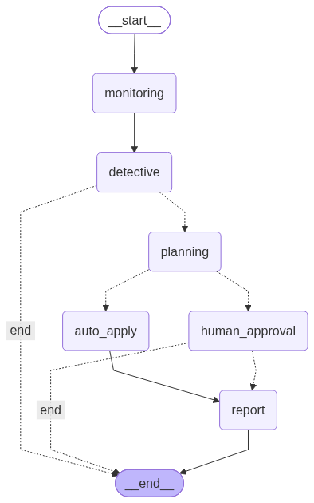

# 🤖 ResolveX AI

**An autonomous DevOps incident detection and resolution system** — powered by a multi-agent LangGraph pipeline with human-in-the-loop approval for risky fixes.

🔗 **Live Dashboard:** [resolvex-ai.streamlit.app](https://malik123arsalan-resolvex-ai-dashboard-2yp3db.streamlit.app/)
🔗 **Backend API:** [resolvex-ai-backend.onrender.com](https://resolvex-ai-backend.onrender.com)

> Note: the backend runs on Render's free tier, which sleeps after 15 minutes of inactivity. The first request after a period of inactivity may take 30–50 seconds to respond while the server wakes up.

---

## 📖 What It Does

ResolveX AI simulates a real DevOps incident-response workflow, end-to-end:

1. **Detects** anomalies (spiking response times, memory leaks, CPU spikes, disk space issues, connection failures)
2. **Investigates** the root cause using an LLM that dynamically decides which tools to call — not a fixed script
3. **Plans** a fix and assesses its risk level
4. **Routes for human approval** if the risk is medium or high; low-risk fixes are auto-applied
5. **Writes a post-incident report** and feeds it back into its own knowledge base, so future investigations can reference past cases

The goal was to build a system that's genuinely **agentic** — the LLM decides what to investigate and what tools to use, rather than following a hardcoded sequence — and to demonstrate that end-to-end with a real, deployed product.

---

## 🧠 The Five Agents

| Agent | Responsibility |
|---|---|
| **Monitoring** | Continuously watches for anomalies and logs incidents |
| **Detective** | Investigates root cause using tool-calling (past-incident search, deployment checks, log inspection) in a ReAct-style reasoning loop |
| **Planning** | Proposes a fix and assigns a risk level, using its own set of tools (rollback checks, downtime estimates, similar-fix search) |
| **Human Approval** | Auto-applies low-risk fixes; pauses medium/high-risk fixes for human review via Slack + dashboard |
| **Report** | Writes a structured post-incident report and stores it for future reference |

All five are orchestrated as nodes in a single **LangGraph** state machine, with conditional routing, checkpointing, and crash recovery.

---

## 🕸️ Orchestration Graph



The graph shows the structural flow of one incident's lifecycle — detection through to resolution or human rejection. What it doesn't show (and what makes this system agentic rather than a fixed pipeline) is the dynamic tool-calling happening *inside* the Detective and Planning nodes, where the LLM decides which tools to invoke and in what order, varying per incident.

---

## 🛠️ Tech Stack

| Layer | Technology |
|---|---|
| Orchestration | LangGraph (StateGraph, conditional edges, `interrupt()`, `SqliteSaver` checkpointing) |
| Backend | FastAPI, deployed on Render |
| Frontend / Dashboard | Streamlit, deployed on Streamlit Community Cloud |
| LLM | Groq (`openai/gpt-oss-120b`), with real tool-calling |
| Database | Supabase (PostgreSQL) |
| Vector Store | ChromaDB — used for root-cause retrieval and self-improving case history |
| Notifications | Slack Incoming Webhooks |
| Validation | Pydantic |

---

## 📊 Dashboard Features

- Live incident metrics (detected, analyzed, pending approval, reported, rejected)
- Full incident table with color-coded status and severity
- Incident detail view — root cause, fix plan, and risk level per incident
- Post-incident report viewer
- One-click **Approve / Reject** for pending incidents, calling the FastAPI backend directly

---

## 🔑 Key Design Decisions

- **Medium and high risk are both routed to human approval** — a safety-first choice, since the cost of an unnecessary approval step is far lower than the cost of an unreviewed risky fix reaching production.
- **Severity and risk are independent concepts.** Severity (how bad the problem is) is set by Monitoring; risk (how risky the fix is to apply) is set by Planning. A low-severity issue can still have a high-risk fix.
- **ChromaDB only stores fully-resolved incidents** — so the knowledge base used for future root-cause retrieval only contains cases with a confirmed outcome, not half-finished investigations.
- **Every failure path updates Supabase explicitly.** Early versions of this system had a bug where an agent's `except` block updated only the in-memory graph state, not the database — leaving incidents silently "stuck" with no visible failure status. Every error path now writes its status back to Supabase.

---

## 🚀 Running It Locally

```bash
git clone https://github.com/malik123arsalan/resolvex-ai.git
cd resolvex-ai
pip install -r requirements.txt
```

Create a `.env` file with:
```
SUPABASE_URL=
SUPABASE_KEY=
GROQ_API_KEY=
SLACK_WEBHOOK_URL=
```

Run the backend and dashboard in two separate terminals:
```bash
uvicorn main:app --reload --host 0.0.0.0 --port 8000
streamlit run dashboard.py
```

---

## 🗺️ Roadmap

- [x] Five-agent pipeline with real LLM tool-calling
- [x] LangGraph orchestration with human-in-the-loop approval
- [x] Crash recovery and restart-safe checkpointing
- [x] Streamlit dashboard with live approve/reject
- [x] Deployed (Render + Streamlit Community Cloud)
- [ ] Chaos engineering test suite
- [ ] Automated test coverage (`pytest`)

---

## 👤 About This Project

Built by **Arsalan Malik** as a hands-on portfolio project while learning agentic AI engineering — going from zero prior experience with FastAPI, LLM APIs, or agent frameworks to a deployed, end-to-end multi-agent system. Developed entirely in GitHub Codespaces.

Connect: [LinkedIn](https://www.linkedin.com/in/arsalan-mustafa-malik/) · [GitHub](https://github.com/malik123arsalan)
